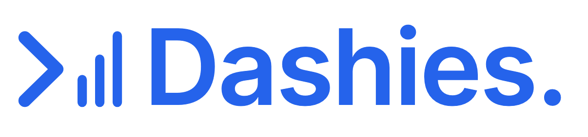
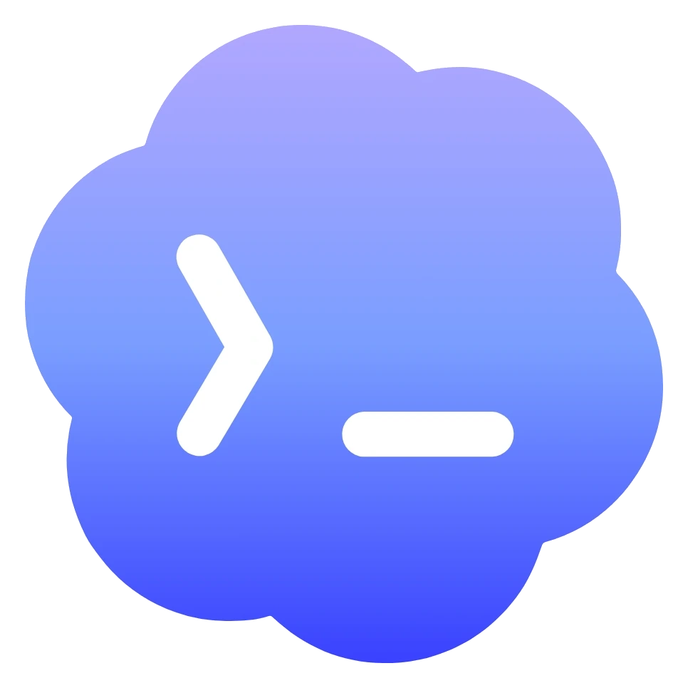
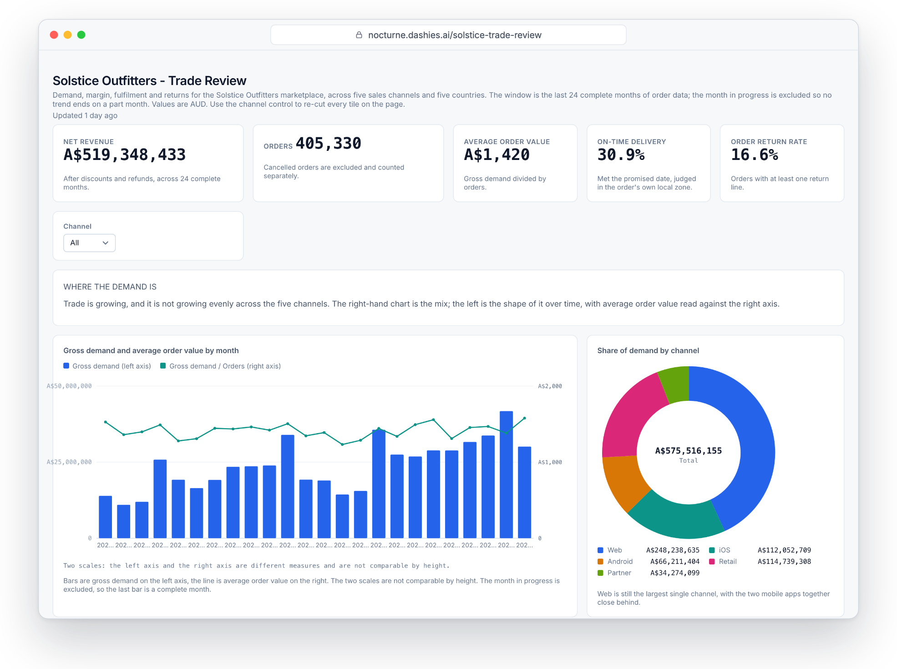
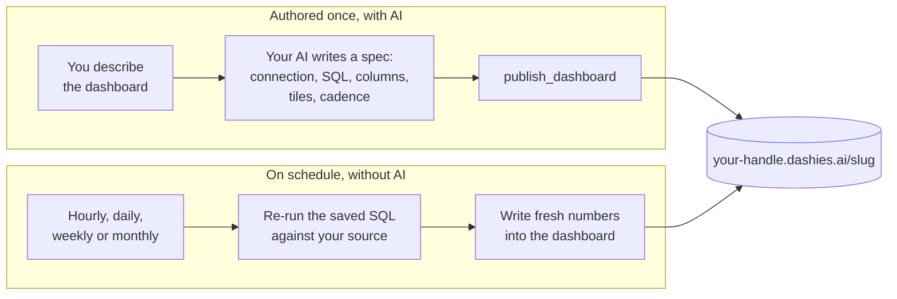

<div align="center">

<a href="https://dashies.ai">
  <picture>
    <source media="(prefers-color-scheme: dark)" srcset="assets/wordmark-dark.png">
    <source media="(prefers-color-scheme: light)" srcset="assets/wordmark-light.png">
    
  </picture>
</a>

### Your AI builds the dashboard. Dashies keeps it alive.

Publish AI-built HTML dashboards to a shareable URL and keep them refreshing on a schedule,<br>with no AI in the loop after the first build.


[Website](https://dashies.ai) ·
[Docs](https://docs.dashies.ai) ·
[Quickstart](https://docs.dashies.ai/start/quickstart) ·
[MCP endpoint](https://mcp.dashies.ai/mcp) ·
[Issues](https://github.com/Dashies-ai/dashies-plugin/issues)

&nbsp; Claude Code &nbsp;&nbsp;&nbsp;
&nbsp; Codex &nbsp;&nbsp;&nbsp;
&nbsp; Cursor

</div>

<a href="https://dashies.ai"></a>

<p align="center"><sub>Built by an AI agent from a BigQuery warehouse and published through this plugin. Every number on it is the output of saved SQL that Dashies re-runs without the AI.</sub></p>

## What's in the box

- **The `dashies` authoring skill.** The playbook your AI follows to build a dashboard that can re-run its own SQL: which connection, one read-only `SELECT` per dataset, what each column means, and how often to refresh. It loads automatically after install.
- **The Dashies publish MCP server.** Tools for publishing, versioning, scheduling and inspecting dashboards, over OAuth. There is no API key to paste.
- **A URL that stays alive.** Every dashboard lives at `https://<your-handle>.dashies.ai/<slug>`, or `https://<workspace>.dashies.ai/<slug>` for a team: versioned, access-gated, and rebuilt from your warehouse on the cadence you choose.

## Install

### Claude Code

```text
/plugin marketplace add https://dashies.ai/marketplace.json
/plugin install dashies@dashies
```

### Codex

```sh
codex plugin marketplace add Dashies-ai/dashies-plugin
codex plugin add dashies@dashies
```

If the marketplace clone fails on SSH host-key verification, use the HTTPS URL: `codex plugin marketplace add https://github.com/Dashies-ai/dashies-plugin.git`.

### Cursor

Cursor 2.5+: search **Dashies** under Customize -> Plugins, or run `/add-plugin` in the editor. The marketplace listing is pending Cursor's review; until it lands, the one-click **Add to Cursor** button in the [install guide](https://docs.dashies.ai/guides/install) adds the connector, and `npx skills add Dashies-ai/dashies-plugin --global --agent cursor` adds the skill.

<details>
<summary><b>Several clients at once, or any other MCP client</b></summary>

<br>

**Every plugin-capable agent on your machine, in one command.** The vendor-neutral [`plugins`](https://www.npmjs.com/package/plugins) CLI detects Claude Code and Cursor and installs Dashies into each:

```sh
npx plugins add Dashies-ai/dashies-plugin
```

Its Windows agent detection is still maturing, so prefer the per-tool commands above there. **On Codex, pick one route and never both**: when this installer detects Codex it registers `dashies@plugins-cli`, while the native commands above register `dashies@dashies`, so running both shows two install cards. `codex plugin list` tells you which one you have.

**Any MCP client, without the skill.** Dashies is a plain remote MCP server at `https://mcp.dashies.ai/mcp`. Claude web, desktop and Cowork add it under Settings -> Connectors; Codex can add just the connector with `codex mcp add dashies --url https://mcp.dashies.ai/mcp`. A bare connector publishes fine, but the authoring skill, which is most of the product's behaviour, only ships with the plugin.

</details>

> [!TIP]
> **No tokens, ever.** The first time your AI calls a Dashies tool, a browser tab opens for a one-time sign-in (OAuth 2.1 + PKCE with dynamic client registration). The token lives in your OS keychain and refreshes itself.

## Your first dashboard

Ask, in plain language:

```text
Build me a Dashies dashboard of last month's signups by plan, and refresh it daily.
```

Your AI reads the schema of your connected source, writes and validates the SQL, publishes a spec, and hands back a link:

```text
https://<your-handle>.dashies.ai/signups-by-plan
```

No warehouse yet? The built-in `self` connection (your own no-PII Dashies usage metrics) is always available, so the [quickstart](https://docs.dashies.ai/start/quickstart) works with no warehouse and no paid plan.

## How the refresh works

The model runs once, at authoring time. After that, refresh is a server-side schedule: it re-runs the saved SQL against your source and rewrites only the numbers. The HTML never changes, and no model runs again.



- **Layout never drifts.** Refresh swaps data, not markup, so a dashboard cannot break visually between runs.
- **Deterministic and cheap.** No model in the refresh path means no re-interpretation and no tokens per run.
- **Checked before it goes live.** A spec publish compiles, validates and seeds the dashboard with real numbers from your connection first, so a structurally broken or silently wrong dashboard is refused rather than published.

## Good to know

- **Scheduled refresh.** Hourly, daily, weekly or monthly, with an every-N multiplier and a timezone anchor. Or refresh on demand.
- **Version history.** Every republish snapshots the previous body. Twenty autosaves are kept, plus up to thirty named versions, and you can roll back to any of them.
- **Safe renames.** The old slug 301-redirects to the new one, so links you already shared keep working.
- **Access-gated by default.** A dashboard opens for its owner or for the members of its workspace; anyone signed out is sent to sign in. Nothing is public.
- **Sandboxed rendering.** Published dashboards run under a strict sandbox CSP, isolated from the rest of the origin.
- **Warehouse connections.** Postgres, BigQuery, Snowflake, Amazon Redshift, Databricks and Microsoft SQL Server, connected in the web app so credentials never pass through your AI.

## The MCP tools

<details>
<summary><b>Every tool, grouped by what it is for</b> (the first call opens the sign-in)</summary>

<br>

**Publish and manage**

| Tool | What it does |
|---|---|
| `publish_dashboard` | Publish a self-contained file (HTML, JSON, CSV or an image, up to ~5 MB), or a YAML spec the server compiles, validates and seeds for you. Returns the stable URL. |
| `update_dashboard` | Change the name, tags or chart kind, or rename the slug. The old slug 301-redirects. |
| `get_dashboard` | Read back a published file. |
| `delete_dashboard` | Retire a dashboard. The URL stops resolving and the bytes are removed. |
| `list_dashboards` | Your active dashboards, newest first, cursor-paginated. |

**Versions**

| Tool | What it does |
|---|---|
| `list_dashboard_versions` | The prior body snapshots of a dashboard, newest first: 20 autosaves plus up to 30 named versions. |
| `get_dashboard_version` | Read one snapshot's body, to inspect or diff it before restoring. |
| `restore_dashboard_version` | Roll back to a snapshot. The current body is snapshotted first, so the restore is normally reversible. |
| `update_dashboard_version` | Name a snapshot ("Before redesign") or clear its label. |

**Authoring**

| Tool | What it does |
|---|---|
| `check_readiness` | What Dashies already knows about the account in one round trip: connections and their health, what is readable behind each, existing dashboards, and the single next step. |
| `list_connections` | The warehouse connections you can build against: id, engine, status, last verified. Never returns secrets. |
| `introspect_schema` | The columns and types a dashboard's SQL may read, with approximate row counts. |
| `explore_data` | One read-only `SELECT` with a small, complete answer, for the questions that come before design. |
| `validate_cube_sql` | Prove a finished `SELECT` survives the executor that will run it unattended on every refresh. |

**Refresh and spec**

| Tool | What it does |
|---|---|
| `get_refresh_status` | Schedule, next run, last run, recent history and errors. Read-only. |
| `set_refresh_schedule` | Cadence (manual, hourly, daily, weekly, monthly), an every-N multiplier and a timezone anchor. |
| `trigger_refresh` | Refresh now instead of waiting for the schedule (paid plans, rate-limited). |
| `get_dashboard_spec` | The stored spec of a spec-backed dashboard, verbatim: the starting point of an edit. Read-only. |
| `derive_dashboard_spec` | Draft a spec from an older hand-authored refreshable dashboard. Stores nothing. |
| `get_source_config` | The stored refresh settings of a hand-authored dashboard. Read-only. |

The live tool schemas at `https://mcp.dashies.ai/mcp` are the contract; the [tools reference](https://docs.dashies.ai/reference/mcp-tools) documents each one.

</details>

## Links

- Website: https://dashies.ai
- Documentation: https://docs.dashies.ai
- Install guide: https://docs.dashies.ai/guides/install
- Marketplace manifest: https://dashies.ai/marketplace.json
- MCP endpoint: https://mcp.dashies.ai/mcp

## License

[MIT](LICENSE)
