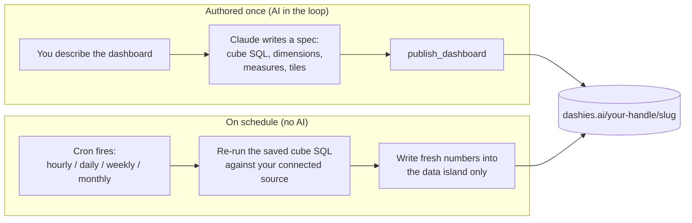

<div align="center">

# Dashies

**Publish AI-built dashboards to a shareable URL, then let them refresh themselves on a schedule - with no AI in the loop after the first build.**

A one-install plugin for [Claude Code](https://claude.com/claude-code), [Codex](https://developers.openai.com/codex), and [Cursor](https://cursor.com): the `dashies` authoring skill plus the Dashies publish MCP server, bundled together.

[Website](https://dashies.ai) ·
[Marketplace](https://dashies.ai/marketplace.json) ·
[MCP server](https://mcp.dashies.ai/mcp) ·
[Report an issue](https://github.com/Dashies-ai/dashies-plugin/issues)


</div>

---

## What it is

Dashies turns a Claude Code conversation into a published, self-contained BI dashboard at a stable URL: `https://dashies.ai/<your-handle>/<slug>`.

You describe the dashboard. Claude builds it as a single HTML file (inline CSS, inline JS, embedded data) and publishes it with one MCP call. You get back a link you can share.

The part that makes Dashies different: **a dashboard can keep itself up to date.** When it is backed by a connected data source, Claude authors the dashboard plus a small JSON manifest (a cube of SQL, dimensions, and additive measures) exactly once. From then on a server-side cron re-runs that SQL on your chosen schedule and rewrites only the numbers in the dashboard's data island. The HTML is never touched again, and no model runs again.

> [!NOTE]
> Anyone can publish a dashboard. Scheduled auto-refresh is the flagship feature, and it requires the dashboard to be backed by a connected data source. A one-off static dashboard publishes fine - it just will not refresh on its own.

## Install

Choose one installation route for each client. For Codex, the native marketplace
route below is recommended. Do not combine it with the multi-client installer:
that installer registers `dashies@plugins-cli`, while the native marketplace
registers `dashies@dashies`, so Codex correctly shows two separate install cards.

### Codex (recommended for Codex)

Two commands in your shell:

```sh
codex plugin marketplace add Dashies-ai/dashies-plugin
codex plugin add dashies@dashies
```

If the marketplace clone fails on SSH host-key verification, use the explicit HTTPS URL: `codex plugin marketplace add https://github.com/Dashies-ai/dashies-plugin.git`.

These commands install the canonical Codex package, `dashies@dashies`.

### Claude Code

Two commands inside Claude Code:

```text
/plugin marketplace add https://dashies.ai/marketplace.json
/plugin install dashies@dashies
```

### Cursor

Install Dashies from the [Cursor marketplace](https://cursor.com/marketplace) (Cursor 2.5+) - search **Dashies** under Customize -> Plugins, or run `/add-plugin` in the editor. _(Marketplace listing pending Cursor's review; until it lands, the one-click MCP below works today.)_

### Several clients at once (alternative)

The vendor-neutral [`plugins`](https://www.npmjs.com/package/plugins) CLI auto-detects
the AI coding agents on your machine and installs Dashies into each. It covers **Claude
Code** and **Cursor** out of the box. **On Windows its agent detection is still maturing**,
so prefer the per-client route above there. For **Codex**, prefer the native route above
for the reason at the top of this section:

```sh
npx plugins add Dashies-ai/dashies-plugin
```

If it detects Codex, this command installs `dashies@plugins-cli`. That is an
alternative to the native `dashies@dashies` route above, not a prerequisite for
it. Use one Codex route, never both.

In every case, the plugin bundles the `dashies` authoring skill and wires up the Dashies MCP server, so there is nothing to configure by hand and no token to paste.

> [!TIP]
> This replaces the older manual MCP setup (`claude mcp add dashies ...` or `codex mcp add dashies --url ...`). If you ran that before, the plugin install supersedes it.

### Authentication: no tokens, ever

Dashies uses the standard MCP **OAuth 2.1 + PKCE** flow with **Dynamic Client Registration**. There are no API keys or tokens to copy, paste, or rotate. The first time you use a Dashies MCP tool, a browser opens for a one-click Google sign-in. The resulting access token is stored in your OS keychain and refreshes automatically; when it expires, the next tool call re-runs the one-click handshake.

### Using another AI tool?

This plugin makes Claude Code, Codex, and Cursor one-install paths, but Dashies is a plain remote MCP server, so any MCP-capable client can publish to it. Point your tool at the same URL - `https://mcp.dashies.ai/mcp`:

- **Cursor (MCP only, no skill)** - prefer the one-install plugin above. For just the MCP, one-click **Add to Cursor** on [dashies.ai](https://dashies.ai), or add `{ "dashies": { "url": "https://mcp.dashies.ai/mcp" } }` under `mcpServers` in `~/.cursor/mcp.json`.
- **Codex (MCP only, no skill)** - prefer the one-install plugin above. For just the MCP, run `codex mcp add dashies --url https://mcp.dashies.ai/mcp`, then `codex mcp login dashies`.
- **Claude web, desktop, and Cowork** - add a custom connector for that URL under Settings -> Connectors.

The same one-click OAuth sign-in applies everywhere, with no token to paste. [dashies.ai](https://dashies.ai) has copy-paste setup for each tool.

## Quick start

Once installed, just ask:

```text
Publish a dashboard of last month's signups by plan.
```

Claude builds a self-contained HTML dashboard, calls `publish_dashboard`, and hands back a live URL:

```text
https://dashies.ai/<your-handle>/signups-by-plan
```

That is the full loop: one request, one shareable link.

## How the no-AI refresh works

The model runs once, at authoring time. After that, refresh is pure server-side cron: it re-executes the saved SQL and writes the new numbers back into the published file's data island. The HTML, the layout, and the bindings stay untouched.



Why this design holds up:

- **The HTML never changes after publish.** Refresh swaps data, not markup, so a dashboard cannot drift or break visually between runs.
- **No model is in the refresh path.** Lower cost, deterministic output, and no risk of an AI re-interpreting your dashboard differently each cycle.
- **The cube is the contract.** A low-cardinality grain plus additive measures is what lets the same SQL re-aggregate forever without re-authoring.

## Features

- **Publish in one call.** A self-contained HTML dashboard becomes a stable, shareable URL scoped to your handle.
- **Self-refreshing dashboards.** Pick hourly, daily, weekly, or monthly. The server re-runs your cube SQL and updates the numbers, with no AI in the loop.
- **Zero-token auth.** OAuth 2.1 + PKCE + Dynamic Client Registration. One browser click, keychain-stored, auto-refreshing.
- **Safe renames.** Renaming a dashboard preserves the old URL with a 301 redirect, so links you already shared keep working.
- **Versioned bodies.** Republishing snapshots the prior body automatically (up to 20 retained). List and roll back to any snapshot.
- **Sandboxed by design.** Published dashboards render under a strict sandbox CSP, isolated from the rest of the origin.
- **Guided authoring.** The bundled `dashies` skill walks you through the connected-data gate, cube design, and filling in the spec (datasets, tiles, schedule) - the server compiles, validates, and seeds it for you.

## What's bundled

### The `dashies` authoring skill

Loads automatically after install. It is the playbook for building a *refreshable* dashboard: the connected-database gate, designing a cube with a low-cardinality grain and additive measures, filling in the Dashies **spec** (datasets + tiles), and choosing a schedule. The server compiles the spec into the HTML, the data island, and the `source_config` manifest, validates it, and seeds it live - you never hand-write the data-dash binding contract, the runtime, or the manifest.

### The MCP tools

OAuth triggers on first use of any tool below (one browser click).

| Tool | What it does |
|---|---|
| `publish_dashboard` | Upload a self-contained HTML / JSON / CSV / image file (up to ~5 MB) and get a stable URL back - or, for a refreshable dashboard, pass a **spec** (YAML) instead and the server compiles, validates, and seeds it into the HTML for you. |
| `update_dashboard` | Edit metadata (name, tags, chart) or rename the slug without re-uploading the body. Renames keep the old URL alive via a 301 redirect. |
| `get_dashboard` | Read back a previously published file. |
| `delete_dashboard` | Retire a dashboard by slug. The URL stops resolving and the bytes are removed. |
| `list_dashboards` | Enumerate your active dashboards, newest first, with cursor pagination. |
| `list_dashboard_versions` | List the saved prior body snapshots of one of your personal dashboards, each with a `version_id`. |
| `restore_dashboard_version` | Roll a personal dashboard back to a prior snapshot. The current body is snapshotted first, so the restore is normally reversible. |
| `get_dashboard_version` | Read back the body of a prior snapshot of a personal dashboard, to inspect or diff it before restoring. |
| `update_dashboard_version` | Set or clear a snapshot's label (a short name like "Before redesign"). Metadata only; the body is untouched. |
| `introspect_schema` | Inspect a connected data source's schema while authoring a cube - the built-in `self` metrics view, or a warehouse connection you own. |
| `validate_cube_sql` | Check a cube's SQL against a connection (`self` or a warehouse you own) before writing it into a spec. |
| `list_connections` | List the warehouse connections you own - Postgres, BigQuery, Snowflake, Amazon Redshift, Databricks, or Microsoft SQL Server (id, label, engine, status, and observed health). Read-only, never returns secrets; warehouses are connected in the Dashies web app. |
| `get_refresh_status` | Check whether a personal dashboard is refreshing on schedule: cadence, next run, last run, and recent run history. Read-only. |
| `set_refresh_schedule` | Set a refreshable dashboard's exact cadence: interval, day/hour, and timezone. |
| `trigger_refresh` | Refresh a dashboard right now instead of waiting for its schedule (paid plans). |
| `get_source_config` | Read back the stored refresh manifest (`source_config`) of a personal dashboard, exactly as saved. Read-only. |
| `get_dashboard_spec` | Read back a spec-backed dashboard's stored spec (the YAML), exactly as saved - your starting point for an edit. Read-only. |
| `derive_dashboard_spec` | Reconstruct a draft spec from an existing refreshable dashboard that isn't spec-backed yet - a read-only migration aid that stores nothing. Publish the draft to convert the dashboard to spec-backed. Read-only. |

## Build your first refreshable dashboard

A refreshable dashboard needs a connected data source, so the authoring flow starts there.

1. **Connect a data source.** Auto-refresh re-runs SQL against a live source, so this is the gate. Connect a warehouse - a Postgres database, a BigQuery project, a Snowflake account, an Amazon Redshift warehouse, a Databricks workspace, or a Microsoft SQL Server database - in the Dashies web app (the Connections page), credentials go through the app, never the AI - or build against Dashies' own built-in `self` metrics. Without a source you can still publish a static dashboard, but it will not refresh on its own.
2. **Ask Claude to build it.** For example: *"Build a refreshable dashboard of weekly active users by plan, and refresh it daily."* The `dashies` skill takes over from here.
3. **Design the cube.** Claude finds your connection with `list_connections`, uses `introspect_schema` to read its tables, then defines a cube: a low-cardinality grain (the dimensions you slice by) and additive measures (counts, sums) that can be re-aggregated safely every cycle.
4. **Validate the SQL.** `validate_cube_sql` confirms the cube runs against your source before anything is published.
5. **Publish with a schedule.** Claude writes a **spec** (the cube's dimensions and measures as datasets, tiles to show them, and your chosen cadence) and calls `publish_dashboard` with it. The server compiles the spec into the HTML, validates it, and seeds it with real numbers from your connection before the URL goes live: `https://dashies.ai/<your-handle>/<slug>`.
6. **Walk away.** The cron re-runs the cube SQL on schedule and writes fresh numbers into the data island. The dashboard stays current with no further AI involvement.

> [!TIP]
> For a one-off snapshot with no live data behind it, you do not need the cube or the manifest. Just ask Claude to publish a static dashboard - one `publish_dashboard` call and you have a URL.

<details>
<summary>Common follow-up requests</summary>

- **"What dashboards do I have?"** - Claude calls `list_dashboards` and summarizes them, newest first.
- **"Rename this dashboard."** - Claude calls `update_dashboard` with a new slug. The old URL 301-redirects to the new one, so shared links keep working.
- **"Roll this back."** - Claude calls `list_dashboard_versions` to find a snapshot, then `restore_dashboard_version` to restore it (personal dashboards only).
- **"Who can see this?"** - Every dashboard is already access-gated: a personal one opens for you, a workspace one for that workspace's members, and a signed-out visitor is sent to sign in. There is no public dashboard and nothing to switch.

</details>

## Links

- Home: https://dashies.ai
- Marketplace manifest: https://dashies.ai/marketplace.json
- MCP server: https://mcp.dashies.ai/mcp
- Issues: https://github.com/Dashies-ai/dashies-plugin/issues

## License

[MIT](LICENSE).

---

<div align="center">

Built by [Dashies](https://dashies.ai). Dashboards that keep themselves up to date.

</div>
